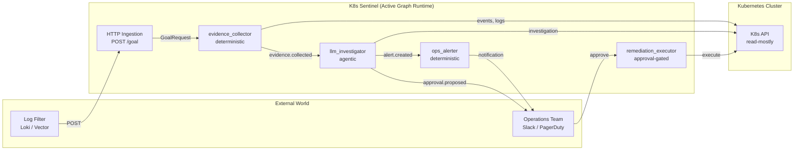

# K8s Sentinel 🛰️

An AI Agent for Kubernetes incident detection, diagnosis, and remediation, built on [Active Graph](https://github.com/yoheinakajima/activegraph).

K8s Sentinel watches your cluster, investigates anomalies with evidence-based reasoning, proposes remediations for human approval, and executes them through a whitelist-gated tool — with every decision permanently recorded in an immutable, replayable audit log.

---

## Example: Detecting an OOMKilled Pod

An external log filter (Loki, Vector, Datadog) notices a spike in `OOMKilled` events and triggers K8s Sentinel:

```bash
curl -X POST http://sentinel.internal:9000/goal \
  -H "Content-Type: application/json" \
  -d '{
    "incident_id": "prod-payments-oom-20260806",
    "namespace": "production",
    "pod_name": "payments-api-7f9d8c-x9z2",
    "anomaly_type": "OOMKilled",
    "severity": "P2"
  }'
```

In under a minute, the agent:

1. **Collects** Kubernetes events, application logs, deployment history
2. **Diagnoses** root cause via LLM reasoning: _"Memory limit 512Mi insufficient for workload"_
3. **Proposes** a remediation: _"Restart deployment with increased memory limit"_
4. **Alerts** the operations team on Slack with full evidence
5. **Waits** for human approval via `POST /approve/{id}` before executing anything

After approval, the agent performs a dry-run, then executes the restart — all recorded in the event log.

```bash
$ activegraph inspect sqlite:///data/sentinel.db --tail 20
[goal.created]           Investigate anomaly
[behavior.started]       sentinel.evidence_collector
[tool.requested]         query_cluster_events
[tool.responded]         2 events returned
[object.created]         Investigation#1
[object.created]         ContextFact#3
[event.emitted]          evidence.collected
[behavior.started]       sentinel.llm_investigator
[llm.requested]          claude-sonnet-4-5
[tool.requested]         query_service_logs
[tool.responded]         47 log lines
[llm.responded]          Root cause: memory limit insufficient
[object.created]         Anomaly#4
[approval.proposed]      Remediation for OOMKilled
...
```

---

## Architecture



The runtime follows a **call-and-drain** pattern: the HTTP server writes a `GoalRequest` object to the graph, then calls `rt.run_until_idle()` to process every resulting event to completion. No polling, no daemons.

---

## Key Features

- **Event-sourced audit trail.** Every tool call, LLM response, and graph mutation is permanently recorded. Inspect any run with `activegraph inspect`.
- **Fork-and-diff for prompt tuning.** Fork a real incident, try a different prompt or configuration, and diff the results against the original diagnosis.
- **Approval-gated execution.** The LLM proposes; humans approve. Destructive actions go through `ctx.propose_object()` and wait for `approval.granted`.
- **Whitelist + kill-switch for writes.** The execution tool enforces a namespace whitelist, action whitelist, and global kill-switch. Dry-run by default.
- **Read-only investigation tools.** The LLM only sees `query_*` and `get_*` tools. It cannot mutate the cluster.
- **Deterministic replay.** Recorded runs are byte-deterministic. Fixtures let you test the agent without a live cluster.

---

## Quickstart

### 1. Install

```bash
git clone https://github.com/your-org/k8s-sentinel.git
cd k8s-sentinel
make dev              # install deps + editable install of the pack
cp .env.example .env  # configure your secrets
```

### 2. Run

```bash
make run              # starts the HTTP ingestion server on :9000
```

### 3. Trigger an investigation

```bash
curl -X POST http://localhost:9000/goal \
  -H "Content-Type: application/json" \
  -d '{
    "incident_id": "demo-001",
    "namespace": "default",
    "pod_name": "demo-pod",
    "anomaly_type": "CrashLoopBackOff",
    "severity": "P3"
  }'
```

### 4. Inspect the run

```bash
activegraph inspect sqlite:///data/sentinel.db --tail 50
```

### 5. Open the dashboard

```bash
make dashboard        # http://localhost:8000
```

---

## How It Works

The full lifecycle is four reactive behaviors chained through events:

```text
GoalRequest (HTTP)
  └─▶ evidence_collector         (deterministic, uses query_cluster_events)
        └─▶ evidence.collected
              └─▶ llm_investigator     (agentic @llm_behavior, tool loop)
                    ├─▶ Anomaly
                    ├─▶ approval.proposed   ← Remediation proposed, not yet created
                    └─▶ Alert
                          └─▶ ops_alerter  (deterministic, send_ops_alert tool)

approval.granted (HTTP /approve/{id})
  └─▶ remediation_executor       (deterministic, execute_remediation tool)
        └─▶ remediation.executed
```

The Remediation object is **only created after approval** — this is how `ctx.propose_object()` works in Active Graph.

---

## Repository Layout

```
k8s-sentinel/
├── k8s_sentinel/            # The Active Graph pack
│   ├── pack.py              # Pack definition (ontology + behaviors)
│   ├── schemas.py           # Pydantic schemas (LLM output + graph objects)
│   ├── prompts.py           # Centralized system prompt
│   ├── ingestion/           # HTTP ingestion layer
│   ├── behaviors/           # Reactive behaviors
│   │   ├── evidence_collector.py
│   │   ├── llm_investigator.py
│   │   ├── ops_alerter.py
│   │   └── remediation_executor.py
│   └── tools/               # Read + write tools
│       ├── query_cluster_events.py
│       ├── query_service_logs.py
│       ├── get_deployment_history.py
│       ├── get_node_resource_status.py
│       ├── send_ops_alert.py
│       └── execute_remediation.py
├── dashboard/               # Read-only inspection UI
├── tests/                   # pytest suite + fixtures
├── deploy/                  # Kubernetes manifests
├── scripts/                 # Operator utilities (fork-and-diff)
└── docs/                    # Architecture + runbooks
```

---

## Configuration

All configuration is via environment variables (see `.env.example`):

| Variable | Required | Description |
|---|:---:|---|
| `ANTHROPIC_API_KEY` | ✅ | LLM provider API key |
| `SLACK_WEBHOOK_URL` | ✅ | Slack incoming webhook for alerts |
| `LOKI_URL` | ✅ | Loki endpoint for log retrieval |
| `ACTIVEGRAPH_RUN_ID` | | Stable run ID for persistence |
| `ACTIVEGRAPH_PERSIST_TO` | | Store URL (default: `sqlite:///data/sentinel.db`) |
| `INGESTION_HOST` / `INGESTION_PORT` | | HTTP server binding (default `0.0.0.0:9000`) |
| `PAGERDUTY_INTEGRATION_KEY` | | Optional PagerDuty escalation |
| `K8S_SENTINEL_EXECUTION_ENABLED` | | **Kill-switch** for write actions (default `false`) |
| `K8S_SENTINEL_ALLOWED_NAMESPACES` | | Comma-separated namespace whitelist |

---

## Operator Workflow

### Inspect a run

```bash
activegraph inspect sqlite:///data/sentinel.db --tail 100
activegraph inspect sqlite:///data/sentinel.db --event evt_042
```

### Fork and diff (tune prompts against past incidents)

```bash
# Fork a real incident at the evidence collection point
python scripts/fork_and_diff.py \
  --store sqlite:///data/sentinel.db \
  --parent-run k8s-sentinel-prod \
  --at-event evt_042 \
  --fork-run experiment-prompt-v2

# Compare diagnoses
activegraph diff sqlite:///data/sentinel.db \
  --run-a k8s-sentinel-prod \
  --run-b experiment-prompt-v2
```

This is how you continuously improve the agent's reasoning without re-deploying.

### Replay a run

```bash
# Strict replay: proves the event log still matches current behaviors
activegraph replay sqlite:///data/sentinel.db --run k8s-sentinel-prod --strict
```

---

## Safety Model

The agent operates on a strict **read-by-default, write-by-approval** model:

| Layer | Protection |
|---|---|
| **LLM tools** | Only read-only (`query_*`, `get_*`). No write tools are exposed. |
| **Remediation proposal** | `ctx.propose_object()` — remediation is not created on the graph until `approval.granted`. |
| **Execution whitelist** | Only `delete_pod`, `scale_deployment`, `restart_deployment` are allowed. |
| **Namespace whitelist** | `K8S_SENTINEL_ALLOWED_NAMESPACES` restricts which namespaces the agent can touch. |
| **Kill-switch** | `K8S_SENTINEL_EXECUTION_ENABLED=false` (default) disables all writes globally. |
| **Dry-run by default** | Every execution first performs `dry_run="All"` against the K8s API. |
| **RBAC minimum** | ServiceAccount has only `get`, `list`, `delete` (pods), `patch` (deployments). No secrets, no RBAC writes. |

The audit log itself (`activegraph inspect`) is the final line of defense: every action taken is immutably recorded.

---

## Testing

```bash
make test              # full suite
make lint              # ruff
make typecheck         # mypy
```

The test suite uses:

- **Fixtures** (`tests/fixtures/`) of real K8s events and Loki responses
- **Mocks** for read-only tools, so no live cluster is needed
- **Replay tests** that verify `Runtime.load(..., replay_strict=True)` reproduces the same graph
- **End-to-end tests** that exercise the full lifecycle from `GoalRequest` to `remediation.executed`

---

## Deployment

Production manifests live in `deploy/`:

- `namespace.yaml` — dedicated namespace
- `rbac-readonly.yaml` — read-only ClusterRole
- `rbac-remediation.yaml` — write ClusterRole (pods, deployments only)
- `statefulset.yaml` — singleton agent with PVC for the SQLite store
- `dashboard.yaml` — read-only inspection UI
- `secrets.yaml.example` — template for API keys

For production, switch from SQLite to PostgreSQL by setting `ACTIVEGRAPH_PERSIST_TO=postgresql://...` — Active Graph supports both backends transparently.

---

## Known Limitations

- **Single-replica agent.** The SQLite store requires a single writer. For multi-replica deployments, use PostgreSQL.
- **LLM cost on noisy clusters.** A busy cluster can generate many investigations. Use the external log filter aggressively to deduplicate and pre-screen.
- **Action parser is rule-based.** The `remediation_executor` translates the LLM's natural-language action into a Kubernetes call via simple heuristics. Future versions will let the LLM emit structured action specs directly.

---

## License

Proprietary. See `LICENSE` for details.

---

Built with [Active Graph](https://github.com/yoheinakajima/activegraph) by Yohei Nakajima.
